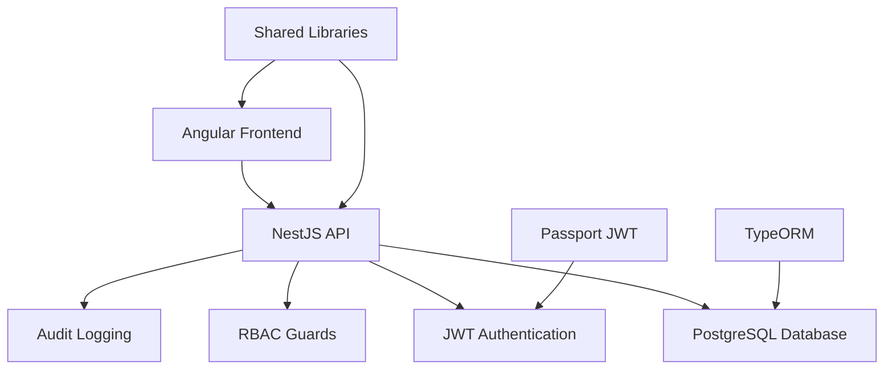
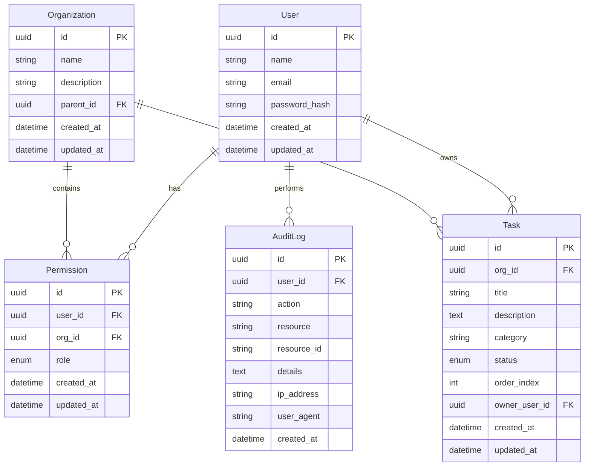

# 🚀 Secure Task Management System

A full-stack, secure task management system built with **NX monorepo**, **NestJS**, **Angular**, and **PostgreSQL**. Features role-based access control (RBAC), JWT authentication, and a modern drag-and-drop interface.

## 📋 Table of Contents

- [Overview](#overview)
- [Architecture](#architecture)
- [Features](#features)
- [Tech Stack](#tech-stack)
- [Setup Instructions](#setup-instructions)
- [API Documentation](#api-documentation)
- [Data Model](#data-model)
- [Access Control](#access-control)
- [Testing](#testing)
- [Future Considerations](#future-considerations)

## 🎯 Overview

This project implements a secure task management system with the following key features:

- **Role-Based Access Control (RBAC)** with three roles: Owner, Admin, Viewer
- **JWT Authentication** with secure token handling
- **Organizational Hierarchy** with 2-level organization structure
- **Task Management** with drag-and-drop functionality
- **Audit Logging** for security and compliance
- **Responsive Design** with Tailwind CSS

## 🏗 Architecture

### NX Monorepo Structure

```
apps/
├── api/           # NestJS Backend API
└── dashboard/     # Angular Frontend

libs/
├── data/          # Shared TypeScript interfaces & DTOs
└── auth/          # Reusable RBAC logic and decorators
```

### System Architecture



## ✨ Features

### 🔐 Authentication & Authorization
- JWT-based authentication
- Role-based access control (Owner > Admin > Viewer)
- Organization-scoped permissions
- Secure password hashing with bcrypt

### 📊 Task Management
- Create, read, update, delete tasks
- Drag-and-drop task status changes
- Task categorization and filtering
- Real-time task statistics
- Responsive kanban board interface

### 🏢 Organizational Structure
- 2-level organization hierarchy
- User-organization relationships
- Role inheritance within organizations
- Scoped data access

### 📝 Audit & Compliance
- Comprehensive audit logging
- User action tracking
- Security event monitoring
- Admin-only audit log access

## 🛠 Tech Stack

### Backend
- **NestJS** - Progressive Node.js framework
- **TypeORM** - Object-Relational Mapping
- **PostgreSQL** - Primary database
- **JWT** - Authentication tokens
- **Passport** - Authentication middleware
- **bcrypt** - Password hashing

### Frontend
- **Angular 20** - Modern web framework
- **Tailwind CSS** - Utility-first CSS
- **Angular CDK** - Drag-and-drop functionality
- **NgRx** - State management
- **RxJS** - Reactive programming

### Development
- **NX** - Monorepo management
- **TypeScript** - Type-safe development
- **Jest** - Testing framework
- **Docker** - Containerization

## 🚀 Setup Instructions

### Prerequisites

- Node.js 18+ 
- PostgreSQL 14+
- Docker (optional)
- npm or yarn

### 1. Clone and Install

```bash
git clone <repository-url>
cd task-management-angular
npm install
```

### 2. Environment Setup

Copy the environment template:

```bash
cp apps/api/env.template apps/api/.env
```

Update the `.env` file with your configuration:

```env
# Database Configuration
DB_HOST=localhost
DB_PORT=5432
DB_USER=postgres
DB_PASSWORD=postgres
DB_NAME=rbac_system

# JWT Configuration
JWT_SECRET=your-super-secret-jwt-key-change-this-in-production
JWT_EXPIRY=1800

# API Configuration
PORT=3000
NODE_ENV=development

# CORS Configuration
CORS_ORIGIN=http://localhost:4200
```

### 3. Database Setup

#### Option A: Using Docker (Recommended)

```bash
# Start PostgreSQL container
docker-compose up -d postgres

# Wait for database to be ready
docker-compose logs postgres
```

#### Option B: Local PostgreSQL

1. Install PostgreSQL locally
2. Create database: `rbac_system`
3. Update connection details in `.env`

### 4. Initialize Database

```bash
# Run database migrations and seed data
npm run db:setup
```

### 5. Start Applications

```bash
# Start both API and Dashboard
npm run start:dev

# Or start individually:
npm run start:api      # Backend on http://localhost:3000
npm run start:dashboard # Frontend on http://localhost:4200
```

### 6. Access the Application

- **Frontend**: http://localhost:4200
- **API**: http://localhost:3000/api
- **API Documentation**: http://localhost:3000/api/docs (if Swagger is enabled)

## 📚 API Documentation

### Authentication Endpoints

#### POST /api/auth/login
Login with email and password.

**Request:**
```json
{
  "email": "user@example.com",
  "password": "password123"
}
```

**Response:**
```json
{
  "accessToken": "eyJhbGciOiJIUzI1NiIsInR5cCI6IkpXVCJ9...",
  "user": {
    "id": "uuid",
    "email": "user@example.com",
    "name": "User Name",
    "role": "ADMIN"
  }
}
```

### Task Management Endpoints

#### GET /api/tasks
Get all accessible tasks (scoped by user's organizations).

**Headers:** `Authorization: Bearer <token>`

**Query Parameters:**
- `orgId` (optional): Filter by organization
- `status` (optional): Filter by status (TODO, IN_PROGRESS, DONE)
- `category` (optional): Filter by category
- `limit` (optional): Number of results (default: 5)
- `offset` (optional): Pagination offset (default: 0)

#### POST /api/tasks
Create a new task.

**Headers:** `Authorization: Bearer <token>`

**Request:**
```json
{
  "title": "Task Title",
  "description": "Task description",
  "category": "Work",
  "status": "TODO",
  "orgId": "organization-uuid"
}
```

#### PATCH /api/tasks/:id
Update an existing task.

**Headers:** `Authorization: Bearer <token>`

#### DELETE /api/tasks/:id
Delete a task.

**Headers:** `Authorization: Bearer <token>`

### Audit Log Endpoints

#### GET /api/audit-logs
Get audit logs (Admin/Owner only).

**Headers:** `Authorization: Bearer <token>`

**Query Parameters:**
- `orgId` (optional): Filter by organization
- `limit` (optional): Number of results
- `offset` (optional): Pagination offset

## 🗄 Data Model

### Entity Relationship Diagram



### Role Hierarchy

```
OWNER (Highest)
├── Full access to all organizations
├── Can manage all users and permissions
└── Can view all audit logs

ADMIN
├── Manage tasks within assigned organizations
├── Can create/edit/delete tasks
└── Limited audit log access

VIEWER (Lowest)
├── Read-only access to assigned organizations
├── Can view tasks
└── Cannot modify data
```

## 🔒 Access Control Implementation

### JWT Authentication Flow

1. User submits credentials to `/api/auth/login`
2. Server validates credentials against database
3. Server generates JWT token with user information
4. Client stores token and includes in subsequent requests
5. Server validates token on protected routes

### RBAC Implementation

```typescript
// Example: Task creation requires ADMIN or OWNER role
@Post()
@Roles(Role.ADMIN, Role.OWNER)
@UseGuards(JwtAuthGuard, RbacGuard)
async create(@Body() createTaskDto: CreateTaskDto, @Request() req: any) {
  return this.taskService.create(createTaskDto, req.user.id);
}
```

### Permission Scoping

- **Organization-level**: Users can only access data within their assigned organizations
- **Role-based**: Different actions require different role levels
- **Resource-level**: Users can only modify resources they own or have permission for

## 🧪 Testing

### Running Tests

```bash
# Run all tests
npm test

# Run API tests only
npm run test:api

# Run Dashboard tests only
npm run test:dashboard

# Run tests with coverage
npm run test:coverage
```

### Test Coverage

- **Backend**: RBAC logic, authentication, API endpoints
- **Frontend**: Components, state management, user interactions
- **Integration**: API-Frontend communication

### Test Examples

```typescript
// Backend: RBAC Guard Test
describe('RbacGuard', () => {
  it('should allow ADMIN role to access ADMIN endpoints', () => {
    const user = { role: 'ADMIN' };
    const result = guard.canActivate(context);
    expect(result).toBe(true);
  });
});

// Frontend: Component Test
describe('TasksComponent', () => {
  it('should display tasks in kanban board', () => {
    component.tasks = mockTasks;
    fixture.detectChanges();
    expect(component.todoTasks.length).toBe(2);
  });
});
```

## 🔮 Future Considerations

### Security Enhancements
- **JWT Refresh Tokens**: Implement token refresh mechanism
- **CSRF Protection**: Add CSRF tokens for state-changing operations
- **Rate Limiting**: Implement API rate limiting
- **RBAC Caching**: Cache permission checks for better performance

### Advanced Features
- **Role Delegation**: Allow users to delegate roles temporarily
- **Advanced Permissions**: Granular permission system
- **Multi-tenancy**: Support for multiple organizations
- **Real-time Updates**: WebSocket integration for live updates

### Production Readiness
- **Database Migrations**: Automated migration system
- **Health Checks**: Application health monitoring
- **Logging**: Structured logging with correlation IDs
- **Monitoring**: Application performance monitoring
- **CI/CD**: Automated testing and deployment

### Scaling Considerations
- **Database Optimization**: Query optimization and indexing
- **Caching Strategy**: Redis for session and permission caching
- **Load Balancing**: Horizontal scaling support
- **Microservices**: Break down into smaller services

## 📝 Development Notes

### Code Organization
- **Shared Libraries**: Common types and utilities in `libs/`
- **Feature Modules**: Organized by domain (auth, tasks, audit)
- **Guards & Interceptors**: Reusable security components
- **DTOs**: Type-safe data transfer objects

### Best Practices
- **Type Safety**: Full TypeScript coverage
- **Error Handling**: Consistent error responses
- **Validation**: Input validation on all endpoints
- **Documentation**: Comprehensive API documentation
- **Testing**: High test coverage with meaningful tests

## 🤝 Contributing

1. Fork the repository
2. Create a feature branch
3. Make your changes
4. Add tests for new functionality
5. Ensure all tests pass
6. Submit a pull request

## 📄 License

This project is licensed under the MIT License - see the LICENSE file for details.

---

**Built with ❤️ using NX, NestJS, and Angular**